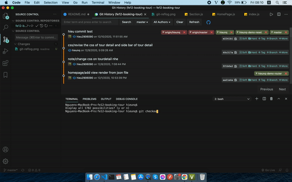

# README CHO ĐỒ ÁN FE12

## 0. WEB THAM KHẢO VỀ GIAO DIỆN

<https://pro.ant.design/>
<https://github.com/zuiidea/antd-admin>
<https://antd-admin.zuiidea.com/chart/highCharts>
<https://viblo.asia/p/7-don-vi-css-co-the-ban-khong-biet-E375zyj6lGW>

## 1. MỘT SỐ LỆNH VỚI GIT

### 1.1. Quy trình khi xây dựng một tính năng mới:

Các bước cần làm là:

[1] -> Checkout ra master
[2] -> pull code mới nhất của master về
[3] -> checkout tạo branch mới về tên theo chức năng
[4] -> code chức năng trên branch mới
[5] -> rebase lại với master
[6] -> push code lên branch hiện tại
[7] -> lên github create pull request rồi chờ admin merge code

```bash
# Kiểm tra branch đang có hiện tại
git branch
git branch -a

# Checkout ra master rồi pull code
git checkout master
git pull

#

# Tạo branch mới theo chức năng
git checkout -b thong/login

# Sau khi code chức năng đầy đủ rồi thì push lên như sau:
# Đứng ở thư mục có file .git

# Nên rebase lại nhánh master để code merge vào nhánh master luôn như sau:
git add .
git commit -m "Mo ta ve lan commit"
git rebase master
git push

# Lần đầu push ở branch mới sẽ có thông báo phải push theo git push --set-upstream origin thong/login

```

Nếu muốn sử dụng lại branch đó thì sau khi pull request xong thì cứ pull master về hoặc checkout master -> pull -> checkout lại về branch đó -> rebase với master.

C1:

```bash
git pull origin master
```

C2:

```bash
git checkout master
git pull
git checkout <branch-can-doi>
git rebase master
```

\*\* Phải đảm bảo trước khi code tính năng nào thì phải pull code mới nhất của master về

Demo cho cả quy trình trên ở file gif như sau


Sau khi push code lên rồi thì phải lên github tạo pull request để admin merge code với master


### 1.2. Các bước delete branch

- Delete branch ở local

```bash
git branch -D <ten-branch-can-delete>
```

- Delete branch ở remote

```bash
git push origin --delete <ten-branch-can-delete>
```

## 2. CÁCH RESET TRÊN GIT

Có 2 cách thường sử dụng khi reset là soft reset và hard reset.
Soft reset: Các thay đổi sẽ được đưa vào stash changes để chờ commit
Hard reset: Bỏ qua các thay đổi, đưa dự án về lần commit đã chọn

Nên checkout ra 1 branch riêng để test các lệnh reset này

```bash
git checkout -b hieunq-test-reset
```

```bash
# Kết hợp git reflog để theo dõi lịch sử thay đổi
git reflog
```


Lựa chọn HEAD muốn reset về

```bash
git reset --hard HEAD@{1}

# Tương tự như lệnh trên thì để reset lui 1 bước dùng lệnh này
git reset --hard HEAD~1 # thay 1 bằng số commit muốn lui lại
```

Để sử dụng git trên toàn dự án thì phải chọn git repo ở đây


Kết hợp với giao diện thì sẽ làm như sau:



## 3. SỬ DỤNG TÍNH NĂNG TRÊN JS

### 3.1. Cách sử dụng localstorage đơn giản

```js
localStorage.setItem("tours", JSON.stringify(tours));
const toursLocal = localStorage.getItem("tours");
console.log(JSON.parse(toursLocal));
```
